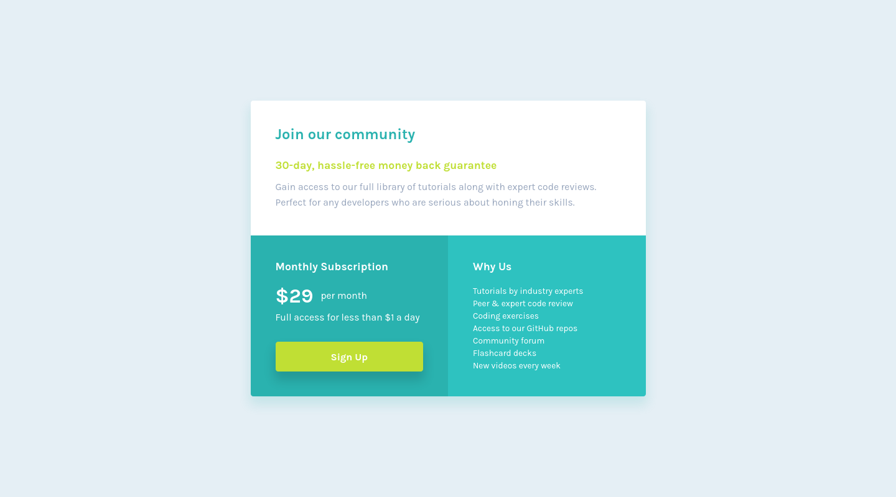

# Frontend Mentor - Single price grid component solution

This is a solution to the [Single price grid component challenge on Frontend Mentor](https://www.frontendmentor.io/challenges/single-price-grid-component-5ce41129d0ff452fec5abbbc). Frontend Mentor challenges help you improve your coding skills by building realistic projects. 

## Table of contents

- [Overview](#overview)
  - [The challenge](#the-challenge)
  - [Screenshot](#screenshot)
  - [Links](#links)
- [My process](#my-process)
  - [Built with](#built-with)
  - [What I learned](#what-i-learned)
  - [Continued development](#continued-development)
- [Author](#author)

## Overview

### The challenge

Users should be able to:

- View the optimal layout for the component depending on their device's screen size

### Screenshot

### Links

- Solution URL: [https://github.com/teempe/frontend-mentor-single-price-grid-component.git](https://github.com/teempe/frontend-mentor-single-price-grid-component.git)
- Live Site URL: [https://teempe.github.io/frontend-mentor-single-price-grid-component/](https://teempe.github.io/frontend-mentor-single-price-grid-component/)

## My process

### Built with

- Semantic HTML5 markup
- CSS custom properties
- Flexbox
- CSS Grid
- Mobile-first workflow

### What I learned

Another good lesson in understanding grid layout.

### Continued development

There is still a lot to learn in regards to creating responsive layouts using grid. 
I need to pay more attention to structure css code, to make it easy to understand 
and maintain in the future.

## Author

- Website - [teempe](https://github.com/teempe)
- Frontend Mentor - [@teempe](https://www.frontendmentor.io/profile/teempe)

